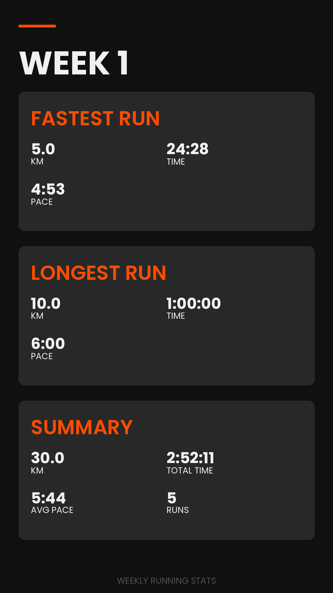

# RunDown - Strava Weekly Running Stats Generator


Generate beautiful weekly summary images of your Strava running activities for any date range.

## Features

- Fetches running data from Strava using the official API
- Generates stylish images with weekly running statistics
- Flexible date selection (specific weeks, date ranges, or last week)
- Shows total distance, duration, average pace, and highlights fastest/longest runs
- OAuth authentication with automatic token refresh

## Example Output



## Installation

1. Clone this repository:
   ```bash
   git clone https://github.com/yourusername/rundown.git
   cd rundown
   ```

2. Install dependencies:
   ```bash
   pip install -e .
   ```

3. Create a `.env` file in the project root with your Strava API credentials:
   ```
   STRAVA_CLIENT_ID=your_client_id
   STRAVA_CLIENT_SECRET=your_client_secret
   ```

## Strava API Setup

1. Create a Strava API application at https://www.strava.com/settings/api
2. Set your application's "Authorization Callback Domain" to `localhost`
3. Note your Client ID and Client Secret for the `.env` file

## Usage

### Basic Usage

```bash
# Generate stats for last complete week
python src/main.py

# Generate stats for a specific week (by any date in that week)
python src/main.py --date 2024-03-15

# Generate stats for a custom date range
python src/main.py --start 2024-03-11 --end 2024-03-17
```

### Advanced Options

```bash
# Custom output file and label
python src/main.py --date 2024-03-15 --output my_stats.png --label "Training Week 5"

# Use short flags
python src/main.py -d 2024-03-15 -o my_stats.png -l "Great Week"
```

### Command Line Options

| Option | Description | Example |
|--------|-------------|---------|
| `--date`, `--week-of` | Generate stats for week containing this date | `--date 2024-03-15` |
| `--last-week` | Generate stats for last complete week (default) | `--last-week` |
| `--start`, `--end` | Custom date range (must use both) | `--start 2024-03-11 --end 2024-03-17` |
| `--output`, `-o` | Output file path | `--output my_stats.png` |
| `--label`, `-l` | Custom title for the image | `--label "Training Week 5"` |

## First Run Authorization

On your first run, you'll be prompted to authorize the application:

1. A browser URL will be displayed
2. Visit the URL and authorize RunDown to access your Strava data
3. Copy the authorization code from the redirect URL
4. Paste it into the terminal when prompted

The authorization tokens are saved and will be automatically refreshed as needed.

## Project Structure

```
rundown/
├── src/
│   ├── main.py              # Main CLI application
│   ├── strava_client/       # Strava API integration
│   ├── data_processors/     # Run data processing
│   ├── image_generator/     # Image generation
│   └── utils/              # Date utilities
├── assets/
│   ├── fonts/              # Font files for image generation
│   └── logo.png            # Project logo
├── output/
│   └── images/             # Generated images
└── .env                    # Your API credentials (create this)
```

## Development

### Setup Development Environment

```bash
# Create virtual environment
python -m venv .venv
source .venv/bin/activate  # Linux/Mac
# or
.venv\Scripts\activate  # Windows

# Install in development mode
pip install -e .
```

## Dependencies

- **stravalib** - Python client for Strava API
- **python-dotenv** - Environment variable management  
- **Pillow** - Image processing library
- **python-dateutil** - Advanced date handling

## Troubleshooting

### Common Issues

1. **"No runs found"** - Check that you have runs in the specified date range
2. **Font loading errors** - The app will fall back to system fonts automatically
3. **Authorization errors** - Delete tokens from `.env` to force re-authorization

### Debug Mode

Add `--verbose` flag (if implemented) for detailed output about what the script is doing.

## License

[MIT License](LICENSE)

## Acknowledgements

- [Strava API](https://developers.strava.com/) for providing access to running data
- [Poppins Font](https://fonts.google.com/specimen/Poppins) by Indian Type Foundry