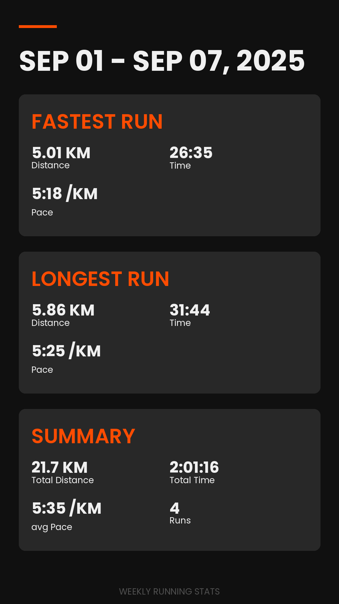

# RunDown - Weekly Strava Running Stats Generator


RunDown is a Python application that generates beautiful weekly summary images of your Strava running activities. Track
your progress, share your achievements, and visualize your running data with eye-catching graphics.

## Features

- Automatically fetches your running data from Strava using the official API
- Generates stylish images with weekly running statistics
- Shows summary stats including total distance, duration, and average pace
- Highlights your fastest and longest runs of the week
- OAuth authentication flow with automatic token refresh
- Designed for automated weekly deployment via cron jobs

## Example Output



## Installation

1. Clone this repository:
   ```bash
   git clone https://github.com/yourusername/rundown.git
   cd rundown
   ```

2. Install dependencies:
   ```bash
   pip install -e .
   ```

3. Create a `.env` file in the project root with your Strava API credentials:
   ```
   STRAVA_CLIENT_ID=your_client_id
   STRAVA_CLIENT_SECRET=your_client_secret
   ```

## Strava API Setup

1. Create a Strava API application at https://www.strava.com/settings/api
2. Set your application's "Authorization Callback Domain" to `localhost`
3. Note your Client ID and Client Secret for the `.env` file

## Usage

### One-time Run

To generate stats for the previous week:

```bash
python -m src.main
```

On first run, you'll be prompted to authorize the application with your Strava account.

### Automated Weekly Updates

Set up a cron job to run weekly (e.g., every Monday morning):

1. Make the deployment script executable:
   ```bash
   chmod +x scripts/deploy_cronjob.sh
   ```

2. Set up the cron job:
   ```bash
   scripts/deploy_cronjob.sh
   ```

## Project Structure

```
.
├── assets
│   ├── fonts
│   │   ├── arial-font
│   │   └── Poppins
│   ├── logo.png
│   └── templates
├── config
│   ├── font_settings.yaml
│   └── settings.yaml
├── output
│   ├── images
│   └── logs
├── scripts
│   ├── deploy_cronjob.sh
│   └── setup_environment.sh
└── src
    ├── data_processors
    │   ├── __init__.py
    │   └── run_data_processor.py
    ├── image_generator
    │   ├── generate_image.py
    │   └── __init__.py
    ├── main.py
    ├── strava_client
    │   ├── auth.py
    │   ├── data_fetcher.py
    │   └── __init__.py
    └── utils
        ├── date_utils.py
        ├── file_io.py
        └── __init__.py
```

## Configuration

The application uses YAML configuration files located in the `config` directory:

- `settings.yaml` - General application settings
- `font_settings.yaml` - Font configuration for image generation

## Development

### Prerequisites

- Python 3.8+
- [tree](https://linux.die.net/man/1/tree) (for development utilities)
- [xclip](https://github.com/astrand/xclip) (for development utilities)

### Setup Development Environment

```bash
# Create and activate virtual environment
python -m venv .venv
source .venv/bin/activate  # Linux/Mac
# or
.venv\Scripts\activate  # Windows

# Install in development mode
pip install -e .
```

### Project Helper Scripts

- `copy_project.sh` - Copies project structure and essential files to clipboard

## Dependencies

- stravalib - Python client for Strava API
- python-dotenv - Environment variable management
- Pillow - Image processing library
- python-dateutil - Advanced date handling

## License

[MIT License](LICENSE)

## Acknowledgements

- [Strava API](https://developers.strava.com/) for providing access to running data
- [Poppins Font](https://fonts.google.com/specimen/Poppins) by Indian Type Foundry
